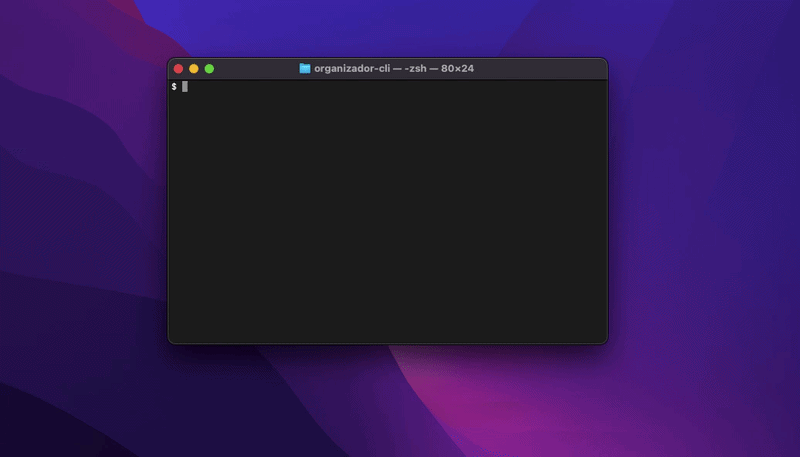

# Organizador de arquivos Genealógicos - CLI
Esse projeto foi criado para resolver um problema pessoal que eu tinha enquanto eu fazia pesquisas sobre minha árvore genealógica.

Eu tinha problemas em anexar arquivos as pastas Materno ou Paterno, os arquivos eram documentos de terras, registros de óbito, registros militares e de batismo, eu achava esses arquivos, baixava e tinha que mover manualmente de uma pasta a outra, eu não queria fazer isso mais pois me demandava tempo, então eu desenvolvi em 4 dias a minha solução, ela me atendeu muito bem e me poupou tempo e paciência, deixando a experiência de procurar/catalogar esses registros mais fluída e confortável

## Instalação

Para instalar todas as dependências necessárias para rodar esse projeto localmente, use esses comandos: 

```bash
git clone git@github.com:pedrohenriquesouza1/organizador-cli.git
```

Esse comando acima clona o repositório a sua máquina local, possibilitando a utilização

```bash 
npm install
```

E esse comando instala automaticamente as dependências necessárias para rodar o projeto

## Como utilizar o organizador

Depois de ter instalado tudo isso, podemos finalmente rodar o projeto, a instrução é simples, use esse comando:

``` bash 
npx tsx src/main.ts ~/[PATH COMPLETO DO ARQUIVO QUE QUER MOVER] ~/[PATH COMPLETO DA PASTA QUE QUER MOVER O ARQUIVO] 
```

**atenção**, certifique-se de sempre estar na pasta do projeto aberta no seu terminal e sempre verifique se o path está correto

Depois de rodar esse comando o programa perguntará:

"Esse arquivo é para a pasta Materno ou Paterno?"

vai ser possível escolher usando as teclas direcionais do seu teclado para alternar entre as opções 

E pronto, o arquivo será movido automaticamente para a pasta designada 
**Ponto importante**: se o programa não achar a pasta Materno ou Paterno no diretório que você escolheu ele vai criar automaticamente a pasta no diretório explicitado

### Exemplo de utilização
Segue um exemplo de utilização 


## Licença
A licença desse projeto está disponível no arquivo .